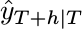
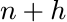
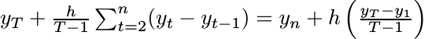

```{r echo=F}
library( devtools )
library( forecast )
require( rCharts )

#dj <- read.csv( file="~/Desktop/Courses/Developing Data Products/DJA.csv", colClasses=c( "character","numeric" ), sep=",", header = TRUE )

dj <- read.csv( file="DJA.csv", colClasses=c( "character","numeric" ), sep=",", header = TRUE )

forecast_period <- 40
end_point <- 250
dj <- ts( dj$DJIA )
dj2 <- window( dj, end=end_point )
```

### Market Forecasting

* A classic goal of Big Data analytics is to predict economic trends

* The Dow Jones Industrial Average is a stock market index, and one of several indices created by Wall Street Journal editor and Dow Jones & Company co-founder Charles Dow

* It is an index that shows how 30 large publicly owned companies based in the United States have traded during a standard trading session in the stock market

* The shiny app uses several forecasting methods that are both simple and effective, to display the market trend based on data from a specified time period, and given a past-data window

* The data we use is drawn from the time period of December 31, 1999 to October 21, 2014

Source of the data:
D.H. Williamson, 'Daily Closing Value of the Dow Jones Average, 1885 to Present,' MeasuringWorth, 2012. 

--- .class #id 

### Average algorithm

* Forecasts of all future values are equal to the mean of the historical data

* Let the historical data be denoted by


* The forecast is given by 


* The notation

is a short-hand for the estimate of

based on the data


* This method can also be used for cross-sectional data, i.e. when predicting a value not included in the data set

* In this instance the prediction for values not observed is the average of those values that have been observed

--- .class #id 

### Naïve algorithm

* This method is only appropriate for time series data

* All forecasts are simply set to be the value of the last observation, i.e. the forecasts of all future values are set to be , denoting the last observed value

* This method works remarkably well for many economic and financial time series

--- .class #id 

### Drift algorithm

* A variation on the naïve method is to allow the forecasts to increase or decrease over time, where the amount of change over time (the drift) is set to be the average change seen in the historical data

* So the forecast for time  is given by



* This is equivalent to drawing a line between the first and last observation, and extrapolating it into the future

--- .class #id 

### App Output

* The app allows the user to select and run any one of the algorithms to display separate graphs based on the selected closing values, and past-data forecasting window

* The following is a sample output that combines all three algorithm outputs in a single graph:
```{r echo=F, results='asis', fig.height = 6, fig.align = 'center'}
plot( dj2, main="Dow Jones Index (daily December 31, 1999 to October 21, 2014)", ylab="Closing", xlab="Day", xlim=c( 2,end_point+40 ) )
lines( meanf( dj2,h=forecast_period )$mean,col=4 )
lines( rwf( dj2,h=forecast_period )$mean,col=2 )
lines( rwf( dj2,drift=TRUE,h=forecast_period )$mean,col=3 )
legend( "topleft",lty=1,col=c( 4,2,3 ), legend=c( "Average method","Naive method","Drift method" ) )
```
